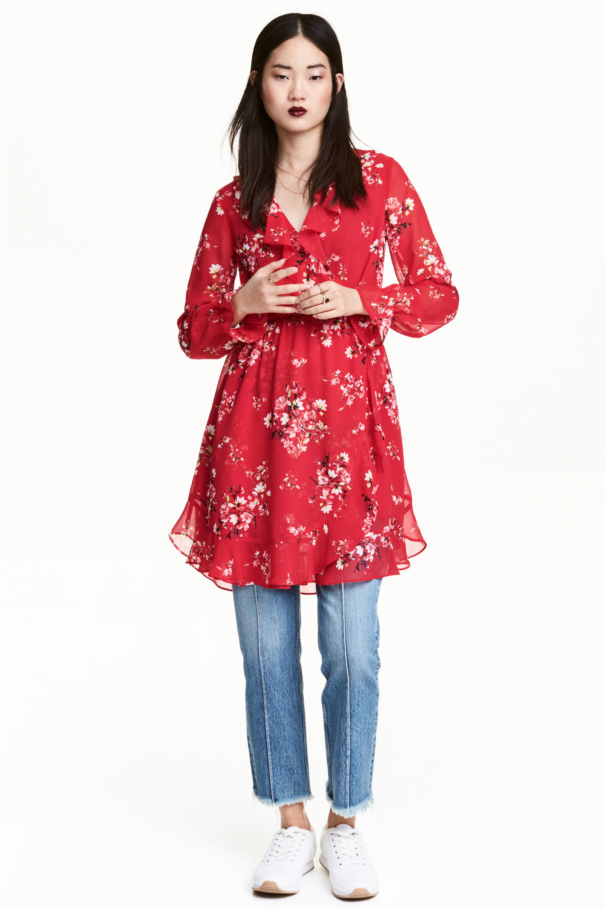

# DressCode
This repository contains code that performs a **catalogue matching** task on a custom dataset.
## Catalogue Matching
Given the catalogue of a retailer as a dataset of photos, the task is to indentificate which of these objects people are wearing in 
real life photos that we call **queries**.
## The Dataset
We choose a dataset that simplfies a bit the task. It consists in all the dresses of the H&M french online catalogue.    
The **real world** photos consists in the models that wear the items. You get associations like these:
## Catalogue Item

## Corresponding Model (Query)

